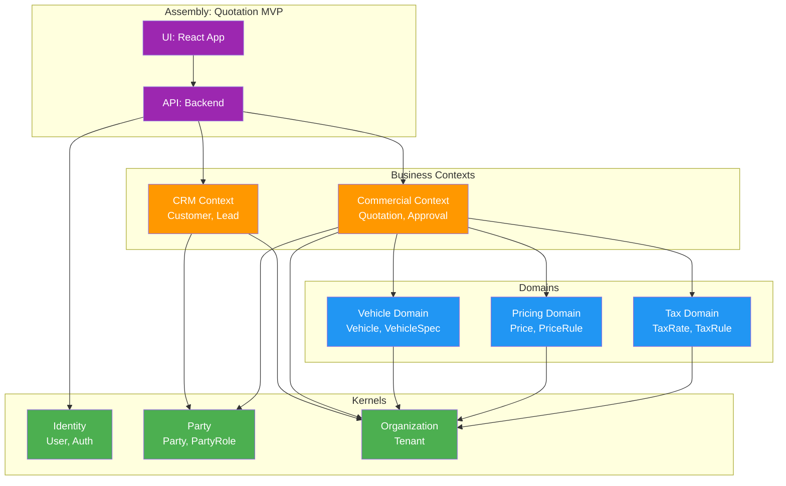
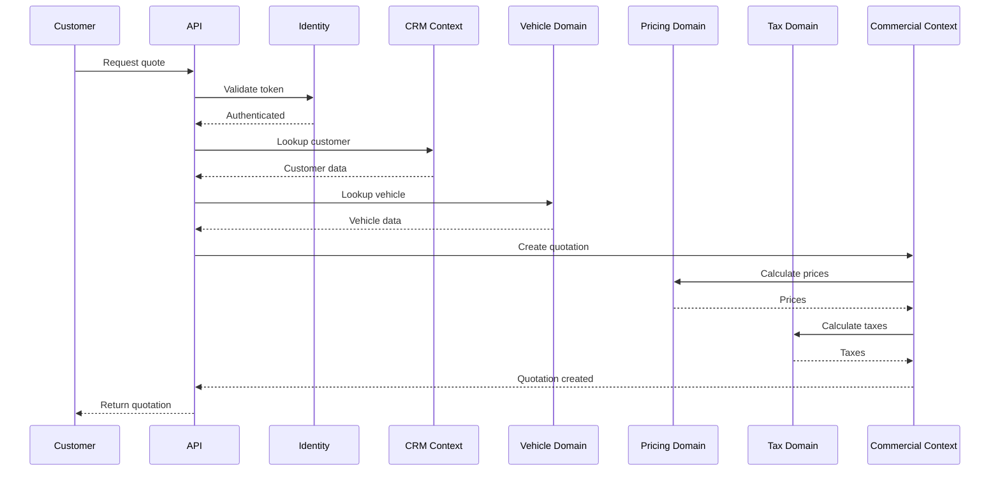

# Example: Automotive Quotation App

## Scenario

An automotive service and repair store needs a digital quotation system.

The store wants to:
- Create quotations for customers
- Look up customer history
- Reference vehicle information
- Apply pricing and taxes
- Get approvals before sending to customer

---

## What Blocks Are Needed

```
┌─────────────────────────────────────────────────────────────┐
│                   ASSEMBLY: Quotation MVP                   │
│                    (Deployable App)                          │
├─────────────────────────────────────────────────────────────┤
│                                                             │
│   UI: React App                                             │
│   ├── QuotationForm                                         │
│   ├── CustomerSearch                                        │
│   └── VehicleLookup                                         │
│                                                             │
│   API: Backend Endpoints                                    │
│   ├── POST /quotations                                      │
│   ├── GET /customers                                        │
│   └── GET /vehicles                                         │
│                                                             │
├─────────────────────────────────────────────────────────────┤
│                                                             │
│   BUSINESS CONTEXTS (compose these)                         │
│   ├── Commercial Context ──────────────────────────────┐    │
│   │   └── Quotation, QuotationItem, Approval          │    │
│   └── CRM Context ──────────────────────────────────┐ │    │
│       └── Customer, Lead, Communication              │ │    │
│                                                     │ │    │
├─────────────────────────────────────────────────────┼─┼────┤
│                                                     │ │    │
│   DOMAINS (reference these)                         │ │    │
│   ├── Vehicle Domain ──────────────────────────┐   │ │    │
│   │   └── Vehicle, VehicleSpec                  │   │ │    │
│   ├── Pricing Domain ────────────────────────┐ │   │ │    │
│   │   └── Price, PriceRule                    │ │   │ │    │
│   └── Tax Domain ──────────────────────────┐ │ │   │ │    │
│       └── TaxRate, TaxRule                  │ │ │   │ │    │
│                                             │ │ │   │ │    │
├─────────────────────────────────────────────┼─┼─┼───┼─┼────┤
│                                             │ │ │   │ │    │
│   KERNELS (always included)                 │ │ │   │ │    │
│   ├── Identity ─────────────────────────┐   │ │ │   │ │    │
│   │   └── User, Auth                    │   │ │ │   │ │    │
│   ├── Party ─────────────────────────┐  │   │ │ │   │ │    │
│   │   └── Party, PartyRole           │  │   │ │ │   │ │    │
│   └── Organization ───────────────┐  │  │   │ │ │   │ │    │
│       └── Organization, Tenant    │  │  │   │ │ │   │ │    │
│                                   │  │  │   │ │ │   │ │    │
└───────────────────────────────────┼──┼──┼───┼─┼─┼───┼─┼────┘
                                    │  │  │   │ │ │   │ │
         ┌──────────────────────────┘  │  │   │ │ │   │ │
         │    ┌────────────────────────┘  │   │ │ │   │ │
         │    │    ┌──────────────────────┘   │ │ │   │ │
         │    │    │    ┌─────────────────────┘ │ │   │ │
         │    │    │    │    ┌──────────────────┘ │   │ │
         │    │    │    │    │    ┌───────────────┘   │ │
         │    │    │    │    │    │    ┌──────────────┘ │
         │    │    │    │    │    │    │    ┌───────────┘
         ▼    ▼    ▼    ▼    ▼    ▼    ▼    ▼
         Dependency Flow (Kernels → Domains → Contexts → Assembly)
```

---

## Package References

| Layer | Package | Purpose |
|---|---|---|
| Kernel | `Automotive.Kernel.Identity` | User authentication |
| Kernel | `Automotive.Kernel.Party` | Customer/supplier management |
| Kernel | `Automotive.Kernel.Organization` | Multi-tenant support |
| Domain | `Automotive.Domain.Vehicle` | Vehicle data |
| Domain | `Automotive.Domain.Pricing` | Price calculation |
| Domain | `Automotive.Domain.Tax` | Tax calculation |
| Context | `Automotive.Context.CRM` | Customer lifecycle |
| Context | `Automotive.Context.Commercial` | Quotation lifecycle |

---

## Architecture Diagram (Mermaid)



---

## Data Flow



---

## Guardrails

- Quotation references Customer by ID (no join to CRM tables)
- Quotation references Vehicle by ID (no join to Vehicle tables)
- Pricing rules are read-only for Commercial Context
- Tax rules are read-only for Commercial Context
- No circular dependencies between contexts
