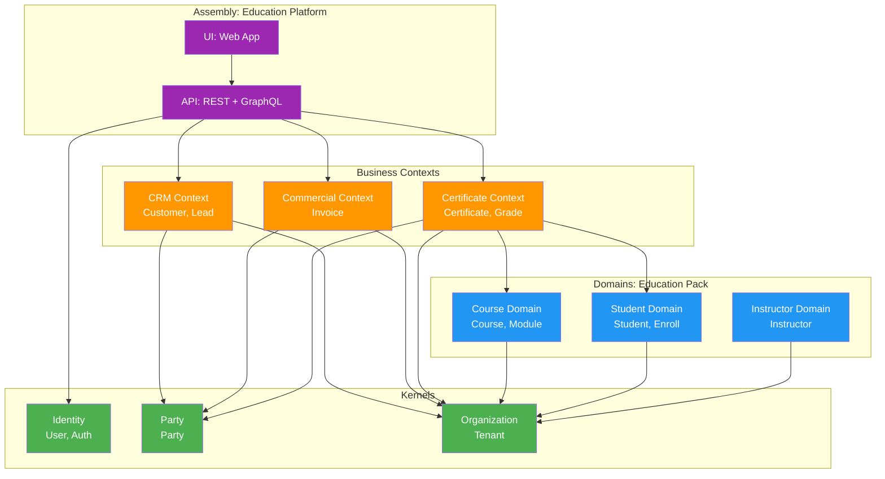
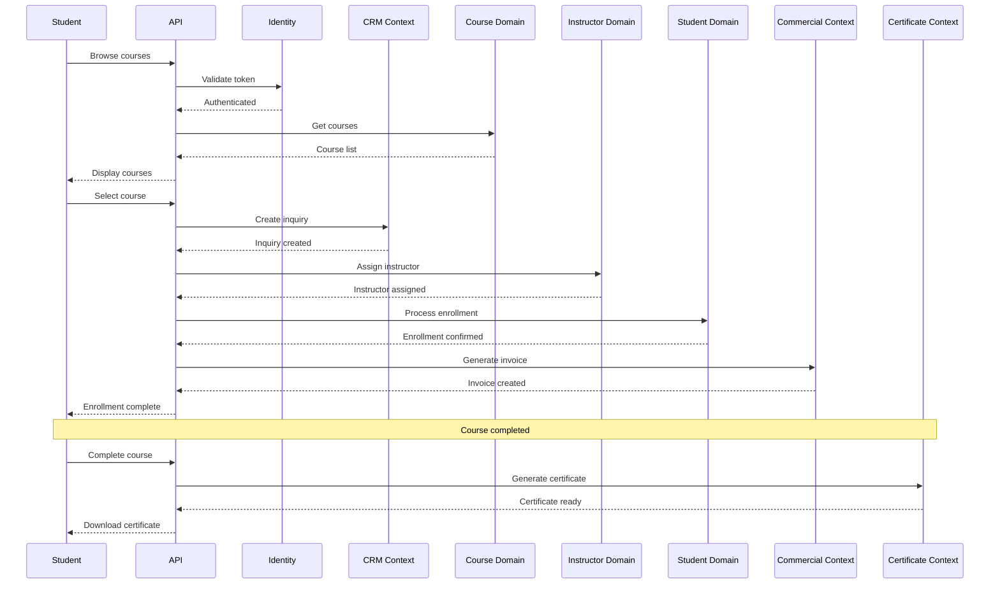

# Example: Education Platform

## Scenario

An education provider needs a platform to manage:
- Course catalog
- Student enrollments
- Instructor assignments
- Certificates for completed courses

The platform also needs CRM for student inquiries and invoicing for course fees.

---

## What Blocks Are Needed

```
┌─────────────────────────────────────────────────────────────┐
│                  ASSEMBLY: Education Platform                │
├─────────────────────────────────────────────────────────────┤
│   UI: Web App (courses, enrollments, certificates)          │
│   API: REST + GraphQL                                        │
├─────────────────────────────────────────────────────────────┤
│                                                             │
│   BUSINESS CONTEXTS                                         │
│   ├── CRM Context ──────────────┐ (reused from automotive)  │
│   │   └── Customer, Lead        │                           │
│   ├── Commercial Context ─────┐ │ (reused — invoicing)      │
│   │   └── Quotation, Invoice  │ │                           │
│   └── Certificate Context ──┐ │ │ (new — education-specific)│
│       └── Certificate, Grade │ │ │                           │
│                              │ │ │                           │
├──────────────────────────────┼─┼─┼───────────────────────────┤
│                                                             │
│   DOMAINS (education pack)                                  │
│   ├── Course ───────────────┐                               │
│   │   └── Course, Module    │                               │
│   ├── Student ────────────┐ │                               │
│   │   └── Student, Enroll │ │                               │
│   └── Instructor ───────┐ │ │                               │
│       └── Instructor     │ │ │                               │
│                          │ │ │                               │
├──────────────────────────┼─┼─┼───────────────────────────────┤
│                                                             │
│   KERNELS (same as automotive)                              │
│   ├── Identity ─────────┐                                   │
│   │   └── User, Auth    │                                   │
│   ├── Party ──────────┐ │                                   │
│   │   └── Party       │ │                                   │
│   └── Organization ─┐ │ │                                   │
│       └── Tenant     │ │ │                                   │
│                      │ │ │                                   │
└──────────────────────┼─┼─┼───────────────────────────────────┘
                       ▼ ▼ ▼
```

---

## Package References

| Layer | Package | Purpose |
|---|---|---|
| Kernel | `Automotive.Kernel.Identity` | User authentication |
| Kernel | `Automotive.Kernel.Party` | Student/instructor management |
| Kernel | `Automotive.Kernel.Organization` | Multi-tenant support |
| Domain | `Education.Domain.Course` | Course catalog |
| Domain | `Education.Domain.Student` | Student data |
| Domain | `Education.Domain.Instructor` | Instructor data |
| Context | `Automotive.Context.CRM` | Student inquiries |
| Context | `Automotive.Context.Commercial` | Course invoicing |
| Context | `Education.Context.Certificate` | Certificate generation |

---

## New Domain Pack: Education

This example introduces a new Industry Pack: `domains/education/`

```
domains/
├── automotive/        ← existing
└── education/         ← NEW
    ├── course.md
    ├── student.md
    └── instructor.md
```

The Education domains define industry-specific concepts while reusing the same Kernels and Business Contexts as automotive.

---

## Architecture Diagram (Mermaid)



---

## Data Flow



---

## Guardrails

- Certificate references Student by PartyId (no join)
- Course invoicing uses same Commercial Context as automotive
- Education domains are independent of automotive domains
- Same Kernels work across industries
