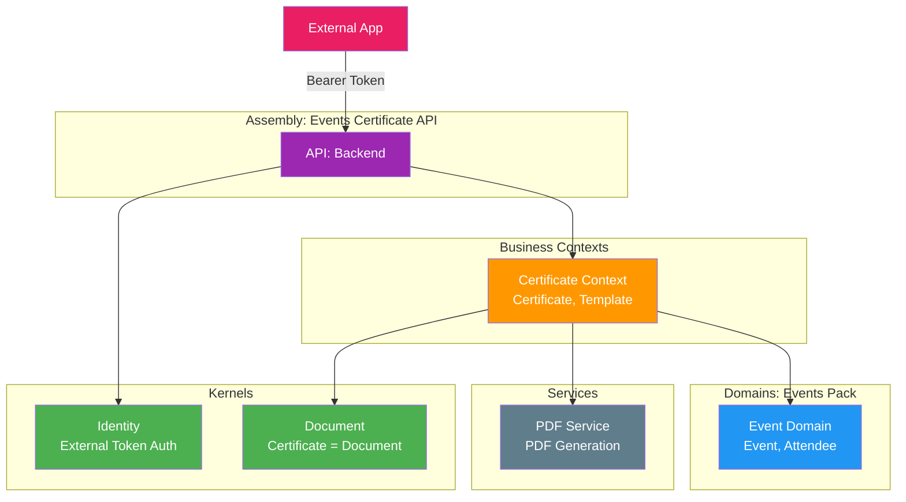
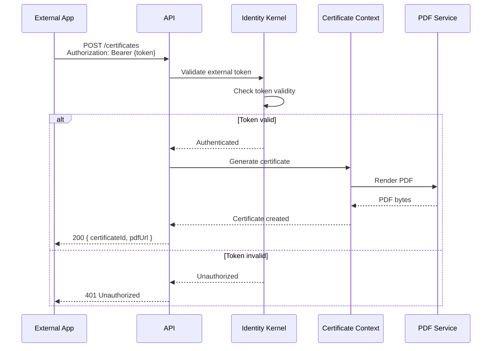

# Example: Events Certificate API

## Scenario

An events company needs an API-only service that:
- Receives attendee data from external event management systems
- Generates certificates for event attendees
- Returns PDF certificates via API

No UI needed. External systems authenticate and call the API.

---

## What Blocks Are Needed

```
┌─────────────────────────────────────────────────────────────┐
│                ASSEMBLY: Events Certificate API              │
├─────────────────────────────────────────────────────────────┤
│                                                             │
│   No UI — API only                                          │
│                                                             │
│   External App ──token──► Your API ──PDF──► External App    │
│                                                             │
├─────────────────────────────────────────────────────────────┤
│                                                             │
│   BUSINESS CONTEXTS                                         │
│   └── Certificate Context ──────────────────────────────────┐
│       └── Certificate, Template, Recipient                  │
│                                                             │
├─────────────────────────────────────────────────────────────┤
│                                                             │
│   DOMAINS (events pack)                                     │
│   └── Event ────────────────────────────────────────────────┐
│       └── Event, Attendee, Schedule                         │
│                                                             │
├─────────────────────────────────────────────────────────────┤
│                                                             │
│   SERVICES                                                  │
│   └── PDF Service ──────────────────────────────────────────┐
│       └── PDF generation, templates                         │
│                                                             │
├─────────────────────────────────────────────────────────────┤
│                                                             │
│   KERNELS                                                   │
│   ├── Identity ──────── (accepts external tokens) ──────────┤
│   └── Document ──────── (certificate = document) ──────────┤
│                                                             │
└─────────────────────────────────────────────────────────────┘
```

---

## Package References

| Layer | Package | Purpose |
|---|---|---|
| Kernel | `Automotive.Kernel.Identity` | External token validation |
| Kernel | `Automotive.Kernel.Document` | Certificate as document |
| Domain | `Events.Domain.Event` | Event data |
| Context | `Events.Context.Certificate` | Certificate generation |
| Service | `Automotive.Service.PDF` | PDF rendering |

---

## Architecture Diagram (Mermaid)



---

## Auth Flow: External Authentication



---

## API Endpoints

```
POST /certificates
  Headers: Authorization: Bearer {external-token}
  Body: { eventId, attendeeName, courseName, completionDate }
  Returns: { certificateId, pdfUrl }

GET /certificates/{id}
  Headers: Authorization: Bearer {external-token}
  Returns: { certificateId, pdfUrl, issuedDate }

GET /certificates/{id}/pdf
  Headers: Authorization: Bearer {external-token}
  Returns: application/pdf
```

---

## Minimal Block Set

This is the simplest possible assembly:

| Block | Why Needed |
|---|---|
| Identity | External auth validation |
| Document | Certificate is a document |
| Event | Event/attendee data |
| Certificate | Certificate generation logic |
| PDF Service | PDF rendering |

No CRM. No Commercial. No invoicing. Just what's needed.

---

## Guardrails

- Identity kernel accepts external tokens (configured for this tenant)
- Certificate Context doesn't know about the external auth system
- PDF Service is called by Certificate Context, not by external app
- No database needed for external app's data (just your certificate records)
