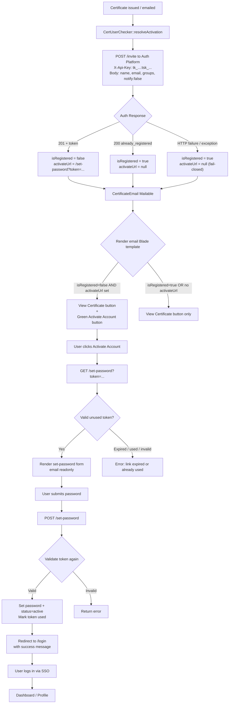

# Cert Activation via Auth Invite — Delta Specification

**Version:** 1.0
**Status:** Final
**Applies to:** `loa-cert-platform` (issuance), `loa-auth-platform` (invite + token page)

---

# 1. Purpose

Replace the cert-activation link model (`/set-password/cert?cert=&email=`, validated by auth→cert HTTP) with invite-gated registration on the Auth Platform:

- No public registration. Accounts are provisioned only via the API-key-authed invite endpoint.
- No auth→cert runtime dependency. Auth never calls cert.
- One email per issuance. No duplicated UX: the single register/set-password page lives on auth.

# 2. Relationship to Existing Specs

| Spec | Relationship |
|------|--------------|
| `cert-activation.md` v1.0 Final | Amended by this delta: §§5–9 (flow, link format, validation, config). Fail-closed rule (§10) preserved. |
| `user-account-activation.md` v1.0 Final (auth) | Implemented by this delta for the cert product: pending → token → active; self-registration stays removed. |
| `tenant-app-api.md` (auth) | `POST /api/v1/tenant/members/invite` gains `notify` + idempotent-existing behavior (D1, D2). |

# 3. Target Flow

## 3.0 Application Layer Diagram

```mermaid
graph TB
    subgraph "User (Browser)"
        U[Certificate Recipient]
    end

    subgraph "Mail System"
        M[SMTP / Mail Queue]
    end

    subgraph "Cert Platform (Laravel)"
        CC[CertificateController / EventController]
        CUC[CertUserChecker::resolveActivation]
        CEM[CertificateEmail Mailable]
    end

    subgraph "Auth Platform (Laravel)"
        INVITE["POST /api/v1/tenant/members/invite<br/>(API-key authed)"]
        SPW[SetPasswordController<br/>GET|POST /set-password]
        TOK[(PasswordSetToken<br/>48h, single-use, sha256)]
        USER[(Users + Tenants<br/>DB)]
    end

    U -->|"1. Admin issues certificate"| CC
    CC -->|"2. resolveActivation(name, email)"| CUC
    CUC -->|"3. POST /invite<br/>X-Api-Key: tk_...:tsk_...<br/>{name, email, groups, notify:false}"| INVITE
    INVITE -->|"4a. 201 + token<br/>(new user)"| CUC
    INVITE -->|"4b. 200 already_registered<br/>(existing user)"| CUC
    INVITE -->|"5. Create pending user<br/>+ tenant member + group"| USER
    INVITE -->|"6. Create token<br/>(sha256, 48h expiry)"| TOK
    CUC -->|"7. Pass isRegistered + activateUrl"| CEM
    CEM -->|"8. Send email"| M
    M -->|"9. Deliver to recipient"| U
    U -->|"10. Click Activate Account<br/>GET /set-password?token=..."| SPW
    SPW -->|"11. Validate token"| TOK
    SPW -->|"12. Show set-password form"| U
    U -->|"13. Submit password<br/>POST /set-password"| SPW
    SPW -->|"14. Hash password, set status=active"| USER
    SPW -->|"15. Mark token used"| TOK
    SPW -->|"16. Redirect to /login"| U
    U -->|"17. SSO login"| SPW
```

## 3.1 End-to-End Mermaid Diagram



## 3.2 Activate Account Button Visibility Conditions

The green "Activate Account" button renders in the email **only** when both conditions are true:

```blade
@if(!($isRegistered ?? true) && ($activateUrl ?? null))
    <a href="{{ $activateUrl }}">Activate Account</a>
@endif
```

| Scenario | `isRegistered` | `activateUrl` | Email Buttons |
|----------|----------------|---------------|---------------|
| New user — invite succeeds (201 + token) | `false` | `{AUTH}/set-password?token=...` | **View** + green **Activate Account** |
| Existing user — Auth returns `already_registered` | `true` | `null` | View only |
| Auth API key missing | `true` | `null` | View only |
| Auth unreachable / timeout | `true` | `null` | View only |
| Auth returns non-2xx | `true` | `null` | View only |
| Auth returns 201 but no token | `true` | `null` | View only |
| Exception in CertUserChecker | `true` | `null` | View only |

**Fail-closed rule:** The Activate Account button never renders when the invite fails. Recipients always receive a working View Certificate link.

## 3.3 ASCII Flow
Issuance (cert backend, 5 call sites — §5)
  |
  | POST {AUTH}/api/v1/tenant/members/invite
  |   X-Api-Key: <tenant key:secret>
  |   {name, email, groups: ["cert-user"], notify: false}
  |
  +---> 201 {status: "invited", token, expires_at}
  |         → cert email: View + Activate ({AUTH}/set-password?token=)
  |
  +---> 200 {status: "already_registered"}
            → cert email: View only
            (transport failure → View only + log; fail-closed)

Recipient clicks Activate (token-bound, email-specific)
  |
  v
GET {AUTH}/set-password?token=   (exists: SetPasswordController::show)
  |  invalid/used/expired → 400/410, no oracle beyond link holder
  v
POST {AUTH}/set-password {token, password, password_confirmation}   (exists: ::set)
  |  user → active, token single-use (used_at)
  v
SSO login → profile (/me/*)
```

# 4. Auth Platform Changes

## D1 — `invite` idempotent for existing emails

File: `app/Http/Controllers/TenantMemberApiController.php` (`invite` method).

- If `users.email` exists: return `200 {status: "already_registered", user: {id, name, email, status}}`.
- No state change: no new user, no membership write, no token, no mail.
- Rationale: replaces the cert-side `isRegistered` probe; the endpoint itself resolves existence. (Caller is an authed service, so no user-enumeration concern.)

## D2 — `invite` gains `notify` flag

- Request: `notify: boolean, default true`.
- `notify=false`: skip the `SetPasswordMail` queue; return raw token show-once in the 201 body: `{status: "invited", user: {...}, token, expires_at}`.
- Raw token travels only over TLS to the API-key-authed caller, used transiently to render the cert email. Never logged or persisted by cert.
- Throttle (`throttle:60,1` on the `tenant` API group, `routes/api.php`) and audit events (`user.created`, `tenant.member_invited`) unchanged.

## No change

`SetPasswordController::show` / `set`, `PasswordSetToken` (48h, single-use, sha256-stored), `SetPasswordMail` template (still used when `notify=true` by other callers).

# 5. Cert Platform Changes

## D3 — Invite client (replaces the existence probe)

- `CertUserChecker::resolveActivation(name, email): ['isRegistered' => bool, 'activateUrl' => ?string]`: `POST {AUTH_BASE_URL}/api/v1/tenant/members/invite` with `X-Api-Key: {AUTH_API_KEY}`, body `{name, email, groups: ["cert-user"], notify: false}`.
- Deploy-time requirement: the `cert-user` group MUST exist on the cert tenant before rollout. `invite` silently skips unknown groups, so a missing group would create membership without group assignment and no runtime signal exists (the 201 body carries no group info).

## D4 — Replace at all 5 call sites (same pattern today)

| Call site | Context |
|-----------|---------|
| `CertificateController.php:313-314` | single issue |
| `CertificateController.php:555-556` | bulk/loop issue |
| `CertificateController.php:1110-1111` | resend |
| `EventController.php:794-795` | bulk issue |
| `EventController.php:990-991` | single issue |

New logic per recipient:

- `201 invited` → `View + Activate`, where Activate = `{AUTH_BASE_URL}/set-password?token={token}`.
- `200 already_registered` → `View only` (`activateUrl = null`).
- Transport failure / non-2xx → `View only` + warning log (fail-closed; preserves `cert-activation.md` §10).

## D5 — Delete superseded code

- `CertUserChecker::isRegistered` (email-existence probe) and `getActivateUrl(cert, email)` (`app/Services/CertUserChecker.php:28,68`) — no longer used. (`AUTH_API_KEY`/`AUTH_BASE_URL` config stays; now load-bearing for issuance.)
- `CertificateEmail::$isRegistered` stays as the View-only switch; its URL source becomes the invite token.

## Performance note (bulk paths)

`EventController:794` and `CertificateController:555` call per-recipient inside the issue loop. v0.1 keeps this synchronous (matches today's per-recipient `isRegistered` call). Follow-up: chunk/queue invite calls if bulk latency regresses.

# 6. Email Shape (unchanged, single mail)

`CertificateEmail` keeps `View Certificate` (public `/verify/...`) + conditional `Activate Account`. Only the Activate href changes (auth token URL). No `SetPasswordMail` is sent when `notify=false` — recipients get exactly one email.

# 7. Security Properties

| Property | Mechanism |
|----------|-----------|
| No public registration | Provisioning requires tenant API key (`api.key.auth`); page requires single-use token |
| Email-bound | Token resolves to one `user_id`; form email readonly |
| Time-limited | 48h (`PasswordSetToken`, created in `invite`) |
| Single-use | `used_at` set on success (`SetPasswordController::set`) |
| No plaintext secrets at rest | Tokens sha256-hashed (password-set tokens, `TenantApiKey` hashes) |
| No oracles | Invalid/used/expired token → uniform 400/410; `already_registered` visible only to the authed service caller |
| Fail-closed send | Invite failure → View-only mail, never a broken Activate link |
| Abuse resistance | `throttle:60,1` on the invite API group; per-IP throttle on `POST /set-password` is a follow-up (§12) |

# 8. Kill List (at cutover — no bridge period)

Decision: `CERT_PLATFORM_URL` is never set in production; links already emailed under the old `/set-password/cert?cert=&email=` format are abandoned (affected recipients are re-issued under the new flow). Remove in the same release:

Auth: `SetPasswordController::showByCert` / `storeByCert`, `GET|POST /set-password/cert` (`routes/web.php:56-61`), `validateCertificate` / `getCertRecipientName`, `config/cert-platform.php`, `CERT_PLATFORM_URL` env.
Cert: per D5.

# 9. Config

No new env vars. Load-bearing (must be set, cf. §9 fixes in `cert-activation.md`):

| Host | Variable | Value |
|------|----------|-------|
| cert-api prod | `AUTH_BASE_URL` | `https://auth.lyceumalabang.edu.ph` |
| cert-api prod | `AUTH_API_KEY` | `tk_...:tsk_...` (tenant key:secret, show-once) |

# 10. Test Plan (executed 2026-09-14 — all green)

Auth: invite new email + `notify=false` → 201, token returned, no mail queued, user `pending` + member + group; repeat same email → 200 `already_registered`, no duplicate user/token/mail; `notify` omitted → mail queued (backward compat); throttle 429s; token replay/expired → 400/410. Full auth suite: passed, no errors.
Cert: `CertUserCheckerTest` 6/6 (invited → token URL + correct invite payload; already_registered / missing key / 500 / missing token / timeout → View-only). Full cert suite: 213 passed, 664 assertions. Per-site mail-content and click-through e2e remain manual verification at rollout (§11 step 4).
Regression: admin-invite path (`notify` default) unchanged.

# 11. Rollout Order

1. Deploy auth (D1, D2 backward compatible: new params optional, existing callers unaffected; §8 deletions ship in the same release — no bridge).
2. Set `AUTH_API_KEY` / `AUTH_BASE_URL` on cert-api prod (the only new prod config; `CERT_PLATFORM_URL` is never deployed).
3. Deploy cert (D3–D5).
4. Re-issue certificates whose old-format activation links were never usable (e.g. CERT-0015) so those recipients receive token links.

# 12. Follow-up Amendments to Final Specs

- ~~`cert-activation.md` §§5–9~~: ✅ DONE (v2.0 Final, amended 2026-09-14)
- ~~`tenant-app-api.md`~~: ✅ DONE (invite docs updated 2026-09-14: `notify`, `already_registered`, `token`/`expires_at`)
- ~~Auth: add per-IP throttle~~: ✅ DONE (`throttle:10,60` on `GET|POST /set-password`, 2026-09-14)
