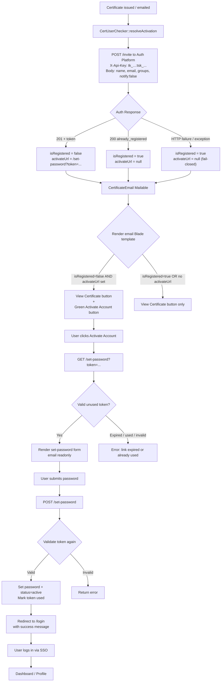

# Certificate Activation — Cross-Platform Specification

**Version:** 2.0
**Status:** Final
**Layer:** Product Assembly (Cert Platform + Auth Platform)
**Audience:** Engineers, AI Development Agents

---

# 1. Purpose

It answers:

> **"How does a certificate recipient who doesn't yet have a cert-user account claim their account and set a password, using only the certificate issuance email?"**

When the Cert Platform issues a certificate, it sends an email to the recipient. If the recipient already has a cert-user account, they see a "View Certificate" button. If they don't have an account, they see an "Activate Account" button that lets them create an account by setting a password — not a full registration form.

The certificate recipient is provisioned via the Auth Platform's invite endpoint, which creates a pending user and returns a one-time token. The token is embedded in the certificate email. No registration form exists. No HTTP call from Auth to Cert occurs at activation time.

---

# 2. Scope

## Owns

- Cert Platform: conditional email content (activate button vs. view-only)
- Cert Platform: invite + existence check via Auth Platform invite endpoint
- Cert Platform: activation URL generation (token from invite response)
- Auth Platform: user creation + tenant/group assignment via invite endpoint
- Auth Platform: password set + activation via existing `/set-password?token=` flow
- Auth Platform: existing user detection (invite returns `already_registered`)

## Does Not Own

- Certificate issuance logic (existing Cert Platform flow)
- Email delivery infrastructure (existing mail system)
- User management UI (Auth Platform admin dashboard)
- JWT token issuance (Auth Platform SSO flow)
- Frontend SPA (e-cert Next.js app)

---

# 3. Architecture

## 3.1 Application Layer Diagram

```mermaid
graph TB
    subgraph "User (Browser)"
        U[Certificate Recipient]
    end

    subgraph "Mail System"
        M[SMTP / Mail Queue]
    end

    subgraph "Cert Platform (Laravel)"
        CC[CertificateController / EventController]
        CUC[CertUserChecker::resolveActivation]
        CEM[CertificateEmail Mailable]
    end

    subgraph "Auth Platform (Laravel)"
        INVITE["POST /api/v1/tenant/members/invite<br/>(API-key authed)"]
        SPW[SetPasswordController<br/>GET|POST /set-password]
        TOK[(PasswordSetToken<br/>48h, single-use, sha256)]
        USER[(Users + Tenants<br/>DB)]
    end

    U -->|"1. Admin issues certificate"| CC
    CC -->|"2. resolveActivation(name, email)"| CUC
    CUC -->|"3. POST /invite<br/>X-Api-Key: tk_...:tsk_...<br/>{name, email, groups, notify:false}"| INVITE
    INVITE -->|"4a. 201 + token<br/>(new user)"| CUC
    INVITE -->|"4b. 200 already_registered<br/>(existing user)"| CUC
    INVITE -->|"5. Create pending user<br/>+ tenant member + group"| USER
    INVITE -->|"6. Create token<br/>(sha256, 48h expiry)"| TOK
    CUC -->|"7. Pass isRegistered + activateUrl"| CEM
    CEM -->|"8. Send email"| M
    M -->|"9. Deliver to recipient"| U
    U -->|"10. Click Activate Account<br/>GET /set-password?token=..."| SPW
    SPW -->|"11. Validate token"| TOK
    SPW -->|"12. Show set-password form"| U
    U -->|"13. Submit password<br/>POST /set-password"| SPW
    SPW -->|"14. Hash password, set status=active"| USER
    SPW -->|"15. Mark token used"| TOK
    SPW -->|"16. Redirect to /login"| U
    U -->|"17. SSO login"| SPW
```

## 3.2 ASCII Architecture

```
┌─────────────────────────────────────────────────────────────────┐
│                        Cert Platform                            │
│  (loa-cert-platform, Laravel)                                   │
│                                                                 │
│  CertificateController / EventController                        │
│       │                                                         │
│       ▼                                                         │
│  CertUserChecker::resolveActivation(name, email)                │
│       │                                                         │
│       ▼                                                         │
│  POST {AUTH}/api/v1/tenant/members/invite                       │
│       │                                                         │
│       ├── 201 invited → token URL in email                      │
│       └── 200 already_registered → View-only email              │
│                                                                 │
│  CertificateEmail Mailable                                      │
│       │                                                         │
│       ▼                                                         │
│  Email sent to recipient                                        │
└─────────────────────────────────────────────────────────────────┘

┌─────────────────────────────────────────────────────────────────┐
│                        Auth Platform                             │
│  (loa-auth-platform, Laravel)                                   │
│                                                                 │
│  POST /api/v1/tenant/members/invite (API-key authed)            │
│       │                                                         │
│       ├── 200 already_registered (no writes)                    │
│       └── 201 invited → pending user + token + group            │
│                                                                 │
│  GET /set-password?token=  (existing)                           │
│       │                                                         │
│       ├── Invalid/expired/used → 400/410                        │
│       └── Valid → set-password form                             │
│                                                                 │
│  POST /set-password  (existing)                                 │
│       │                                                         │
│       └── Set password + activate account → login               │
└─────────────────────────────────────────────────────────────────┘
```

---

# 4. Flow

## 4.0 End-to-End Mermaid Diagram



## 4.1 Email Sending (Cert Platform)

```
Certificate issued
    │
    ▼
CertUserChecker::resolveActivation(name, email)
    │
    │  POST {AUTH}/api/v1/tenant/members/invite
    │  X-Api-Key: {key:secret}
    │  {name, email, groups: ["cert-user"], notify: false}
    │
    ├── 201 invited (token returned)
    │   $isRegistered = false
    │   $activateUrl = {AUTH_BASE_URL}/set-password?token={token}
    │   Email shows "Activate Account" button + "View Certificate" button
    │
    ├── 200 already_registered
    │   $isRegistered = true, $activateUrl = null
    │   Email shows "View Certificate" button only
    │
    └── failure / non-2xx
        $isRegistered = true, $activateUrl = null  (fail-closed)
        Email shows "View Certificate" button only + warning logged
```

## 4.1.1 Activate Account Button Visibility Conditions

The green "Activate Account" button renders in the email **only** when both conditions are true:

```blade
@if(!($isRegistered ?? true) && ($activateUrl ?? null))
    <a href="{{ $activateUrl }}">Activate Account</a>
@endif
```

| Condition | `isRegistered` | `activateUrl` | Button Shown |
|-----------|----------------|---------------|--------------|
| New user invited successfully (201 + token) | `false` | `{AUTH}/set-password?token=...` | **View Certificate** + green **Activate Account** |
| User already exists on Auth (200 already_registered) | `true` | `null` | View Certificate only |
| Auth API key missing / empty | `true` | `null` | View Certificate only |
| Auth unreachable (transport error, timeout) | `true` | `null` | View Certificate only |
| Auth returns non-2xx (500, 429, etc.) | `true` | `null` | View Certificate only |
| Auth returns 201 but token missing/empty | `true` | `null` | View Certificate only |
| Exception thrown during resolveActivation | `true` | `null` | View Certificate only |

**Rule:** The button never appears on failure. Fail-closed is absolute — no broken activate links reach recipients.

## 4.2 Activation Link Click (Auth Platform)

```
User clicks "Activate Account" link
    │
    ▼
GET /set-password?token={raw-token}
    │
    ├── Token invalid, expired, or already used
    │   └── 400/410 — uniform response, no oracle
    │
    ├── Valid token
    │   └── Show set-password form (email readonly)
```

## 4.3 Password Set (Auth Platform)

```
User submits password
    │
    ▼
POST /set-password {token, password, password_confirmation}
    │
    ├── Validate token (not expired, not used)
    │   └── Invalid → back with error
    │
    ├── Set password + activate user (status → active)
    │
    └── Redirect to login with success message
```

---

# 5. API Contracts

## 5.1 Cert Platform → Auth Platform (invite + existence check)

### Invite Recipient

```
POST /api/v1/tenant/members/invite
Headers:
  X-Api-Key: {api_key}
  Accept: application/json

Request body:
  {
    "name": "Juan Dela Cruz",
    "email": "juan@example.com",
    "groups": ["cert-user"],
    "notify": false
  }

Response 201 (new user):
  {
    "status": "invited",
    "user": {"id": "...", "name": "...", "email": "...", "status": "pending"},
    "token": "raw-token-show-once",
    "expires_at": "2026-09-16T12:00:00Z"
  }

Response 200 (existing user):
  {
    "status": "already_registered",
    "user": {"id": "...", "name": "...", "email": "...", "status": "active"}
  }
```

**Logic:** `201` → embed token URL in email; `200` → View-only email; failure → fail-closed View-only.

---

# 6. Email Template Changes

## 6.1 Conditional Button

```blade
@if(!($isRegistered ?? true) && ($activateUrl ?? null))
    {{-- Green "Activate Account" button --}}
    <a href="{{ $activateUrl }}" class="btn btn-success">
        Activate Account
    </a>
    <p>A certificate has been issued in your name. Create your account to access it.</p>
@endif

{{-- Always present: "View Certificate" button --}}
<a href="{{ $viewUrl }}" class="btn btn-primary">
    View Certificate
</a>
```

## 6.2 Button Visibility Decision Table

| Scenario | `isRegistered` | `activateUrl` | Email Buttons |
|----------|----------------|---------------|---------------|
| New user — invite succeeds (201 + token) | `false` | set | **View** + green **Activate Account** |
| Existing user — Auth returns `already_registered` | `true` | `null` | View only |
| Auth API key missing | `true` | `null` | View only |
| Auth unreachable / timeout | `true` | `null` | View only |
| Auth returns non-2xx | `true` | `null` | View only |
| Auth returns 201 but no token | `true` | `null` | View only |
| Exception in CertUserChecker | `true` | `null` | View only |

**Fail-closed rule:** The Activate Account button never renders when the invite fails. Recipients always receive a working View Certificate link.

## 6.3 Mailable Parameters

```php
class CertificateEmail extends Mailable
{
    public function __construct(
        // ... existing params ...
        public bool $isRegistered = true,
        public ?string $activateUrl = null,
    ) {}
}
```

---

# 7. Security Considerations

## 7.1 Invite Gate

- Accounts are provisioned only via the API-key-authed invite endpoint
- No public registration exists; the `/set-password?token=` page requires a valid token
- The invite endpoint creates pending users only; activation requires the token

## 7.2 Existing User Detection

- The invite endpoint returns `200 already_registered` for existing emails
- No duplicate user, membership, or token is created
- No state change occurs on the `already_registered` path

## 7.3 Token Security

- Set-password tokens are SHA-256 hashed before storage
- Tokens expire after 48 hours
- Tokens are single-use (marked as `used_at` after password set)
- Invalid/used/expired tokens return uniform 400/410 — no oracles

## 7.4 Rate Limiting

- `POST /api/v1/tenant/members/invite` is throttled (60 requests per minute per API key)
- `POST /set-password` uses existing throttle (follow-up: per-IP throttle, §12)

## 7.5 Fail-Closed Send

- Invite transport failure → View-only email, never a broken Activate link
- Fail-closed on missing API key, HTTP error, timeout, or unexpected response shape

## 7.6 Privacy

- The `recipient_email` field is added to the public verify endpoint response
- This is acceptable because:
  - Certificate numbers are not predictable
  - The recipient name is already exposed
  - The email is already on the certificate PDF

---

# 8. Error Handling

| Scenario | Behavior |
|----------|----------|
| Missing API key on cert host | Fail-closed: View-only email, warning logged |
| Auth unreachable (transport) | Fail-closed: View-only email, warning logged |
| Auth returns non-2xx | Fail-closed: View-only email, warning logged |
| Auth returns invited but no token | Fail-closed: View-only email, warning logged |
| Token invalid/expired/used | Uniform 400/410 — no oracle beyond link holder |
| User creation fails | Redirect to login with "Unable to create account" |
| Tenant not found | User created but no tenant/group assignment (logged warning) |
| Group not found | User added to tenant but not to group (logged warning) |

---

# 9. Configuration

## 9.1 Cert Platform (`.env` on cert-api host)

```php
// config/auth-platform.php
return [
    'base_url' => env('AUTH_BASE_URL', 'https://auth.lyceumalabang.edu.ph'),
    'api_key' => env('AUTH_API_KEY', ''),
    'http_timeout' => (int) env('AUTH_HTTP_TIMEOUT', 5),
];
```

| Variable | Value | Notes |
|----------|-------|-------|
| `AUTH_BASE_URL` | `https://auth.lyceumalabang.edu.ph` | Auth host public URL |
| `AUTH_API_KEY` | `tk_...:tsk_...` | Full key:secret from Auth admin → Tenants → API keys |
| `AUTH_HTTP_TIMEOUT` | `5` | Seconds |

## 9.2 Auth Platform

No env config needed. Auth never calls Cert.

---

# 10. Anti-Patterns

| Anti-Pattern | Why It Violates |
|--------------|-----------------|
| Creating user without invite token | Arbitrary account creation vulnerability |
| Auth calling Cert at activation time | Runtime dependency; activation works with Cert down |
| Showing activate button when invite fails | Fail-open exposes broken links to recipients |
| Hardcoded tenant slug | Breaks if slug changes; should use config |
| No transaction on user creation | Partial creation leaves inconsistent state |

---

# 11. Open Items

1. **Batch invite calls:** For bulk sends (100+ certificates), individual HTTP calls are slow. Consider chunking or queueing in v2.
2. **Name from certificate:** Currently derives name from email prefix. The invite endpoint already accepts `name`; pass `recipient_name` from the certificate for better defaults.

---

# 12. Testing

## 12.1 Test Files

| Component | Test File | Type |
|-----------|-----------|------|
| `CertUserChecker::resolveActivation` | `tests/Unit/Services/CertUserCheckerTest.php` | Unit |
| Auth invite (D1+D2) | `tests/Feature/Api/TenantMemberApiTest.php` | Feature |
| Auth password set flow | `tests/Feature/Web/SetPassword/` | Feature |

## 12.2 CertUserChecker Unit Tests

| Test | Expected Behavior |
|------|-------------------|
| `test_resolve_activation_returns_token_url_when_invited` | Auth returns 201 + token → `['isRegistered' => false, 'activateUrl' => ...]` |
| `test_resolve_activation_returns_registered_when_already_registered` | Auth returns 200 → `['isRegistered' => true, 'activateUrl' => null]` |
| `test_resolve_activation_returns_registered_when_api_key_missing` | No API key → fail-closed, View-only |
| `test_resolve_activation_returns_registered_when_api_fails` | Auth returns 500 → fail-closed, View-only |
| `test_resolve_activation_returns_registered_when_token_missing` | Auth returns 201 but no token → fail-closed, View-only |
| `test_resolve_activation_returns_registered_when_api_timeout` | HTTP timeout → fail-closed, View-only |

## 12.3 Auth Invite Tests (D1+D2)

| Test | Expected Behavior |
|------|-------------------|
| `testInviteNewUser` | 201: user created, pending, member + group, mail queued |
| `testInviteWithGroups` | 201: user assigned to requested groups |
| `testInviteExistingEmailReturnsAlreadyRegistered` | 200: no duplicate, no membership write, no token, no mail |
| `testInviteNotifyFalseReturnsTokenAndSkipsMail` | 201: raw token returned, `Mail::assertNothingQueued` |
| `testInviteNotifyDefaultSendsMailWithoutToken` | 201: mail queued, no token in response |

## 12.4 Test Mocking Strategy

### CertUserChecker (Unit)

```php
Http::fake([
    "{$this->authBaseUrl}/api/v1/tenant/members/invite" => Http::response([
        'status' => 'invited',
        'token' => str_repeat('a', 64),
    ], 201),
]);
```

### Auth Invite (Feature)

No mocking — uses SQLite in-memory (per `phpunit.xml.dist`), real invite logic, `Mail::fake()` to capture queued mail.

## 12.5 Running Tests

```bash
# Cert Platform — CertUserChecker unit tests
docker exec loa-platform-cert-app-1 php vendor/bin/phpunit --filter=CertUserCheckerTest

# Auth Platform — TenantMemberApiTest (invite + D1+D2)
docker exec loa-platform-auth-app-1 php artisan test --filter=TenantMemberApiTest

# Auth Platform — full suite
docker exec loa-platform-auth-app-1 php artisan test

# Cert Platform — full suite
docker exec loa-platform-cert-app-1 php vendor/bin/phpunit
```

---

# 13. Guiding Principle

> **Invite-gated account creation.** The certificate is the invitation. Auth provisions the user via API, returns a token, and the cert email carries it. No registration form, no Auth→Cert HTTP call. One credential, one session issuer, one email.
